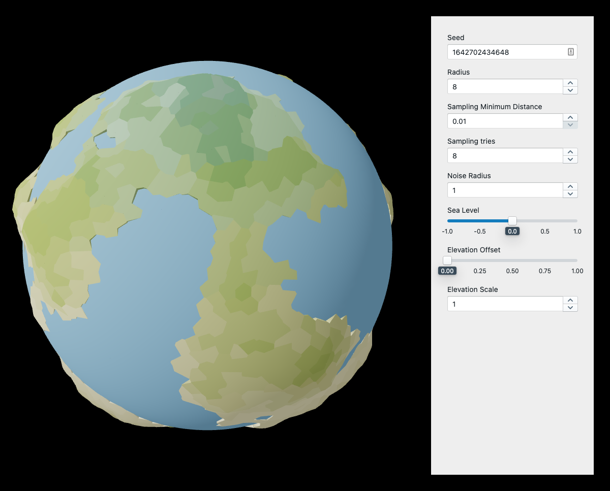

# [3D Procedural Planets](https://webmaestrofr.github.io/planets)

A basic experiment with [react-three-fiber](https://docs.pmnd.rs/react-three-fiber).

[webmaestrofr.github.io/planets](https://webmaestrofr.github.io/planets)
